## Real-Time Ledger & Reconciliation Engine (Fintech System)

A high-accuracy, double-entry fintech ledger engine built with **Java 17**, **Spring Boot 3**, **PostgreSQL**, **Redis**, and **Flyway**.
Implements core financial primitives used in **banks, wallets, UPI, BNPL, and trading platforms**.

This project demonstrates real-world fintech concepts such as:

* 🔐 **Idempotent Transfers (Stripe-style)**
* 💰 **Double Entry Ledger Accounting**
* 🔄 **Reconciliation Engine**
* 🧮 **Balance Consistency Verification**
* 📜 **Immutable Ledger Entries**
* 🧱 **Database Migrations (Flyway)**
* ⚡ **Atomic Transfers**
* 🧂 **Optimized Redis Caching**
* 📊 **Admin Monitoring APIs**

---

# 🚀 Features

## **1. Account Management**

* Create account
* Fetch account balance
* Multi-currency ready (INR by default)

---

## **2. Double Entry Ledger Engine**

Every transfer creates **two immutable ledger entries**:

```
Debit:  -50000 (sender)
Credit: +50000 (receiver)
```

Ensures that the ledger always sums to **zero**.

---

## **3. Idempotent Transfers (Safety Against Duplicate Requests)**

Using Redis:

```
Idempotency-Key: abc-123
```

If the same request is retried due to network issues, the backend **returns the same transactionId** instead of double-charging.

---

## **4. Reconciliation Engine**

Runs manually or via scheduler.

Checks:

* Ledger sum == 0
* Ledger delta per account == account balance
* No orphan ledger entries
* No mismatched totals

Results stored in `reconciliation_reports`.

---

## **5. Admin Tools**

* View latest reconciliation status
* View reconciliation history
* Fetch all anomalies
* Fetch all transactions
* Paginated transaction search
* View ledger entries for a transaction

---

# 🏛 Architecture

## **🧱 High-Level Architecture**


---

# 🗄 Database Schema


---

# 🔄 Transfer Flow (Sequence Diagram)

```mermaid
sequenceDiagram
    participant C as Client
    participant API as LedgerController
    participant S as LedgerService
    participant R as Redis
    participant A as Accounts DB
    participant L as Ledger DB
    participant T as Transactions DB

    C->>API: POST /transfer (Idempotency-Key)
    API->>S: validate + process transfer

    S->>R: check idempotency key
    alt Exists
        R-->>S: return existing txId
        S-->>API: return SUCCESS
    end

    S->>A: fetch sender & receiver accounts
    S->>A: check balance

    S->>L: insert debit ledger entry
    S->>L: insert credit ledger entry

    S->>A: update balances

    S->>T: save transaction SUCCESS
    S->>R: store idempotency key → txId

    API-->>C: return transactionId
```



---

# 💰 Deposit Flow (Sequence Diagram)


---

# 🧪 API Endpoints

## **Create Account**

```
POST /api/accounts
```

## **Deposit**

```
POST /api/transactions/deposit
```

## **Transfer (with Idempotency-Key)**

```
POST /api/transactions/transfer
Idempotency-Key: xyz-123
```

## **Get Account Balance**

```
GET /api/accounts/{accountId}
```

## **Get Transactions for Account**

```
GET /api/transactions/account/{accountId}?page=0&size=10
```

## **Get Ledger Entries for Transaction**

```
GET /api/ledger/{transactionId}
```

## **Run Reconciliation**

```
GET /api/admin/reconciliation/run
```

---

# 🏁 Running the Project

### **1. Start Postgres + Redis (Docker)**

```
docker compose up -d
```

### **2. Run Spring Boot**

```
mvn spring-boot:run
```

### **3. Flyway auto-migrates DB**

Tables are created automatically.

---
